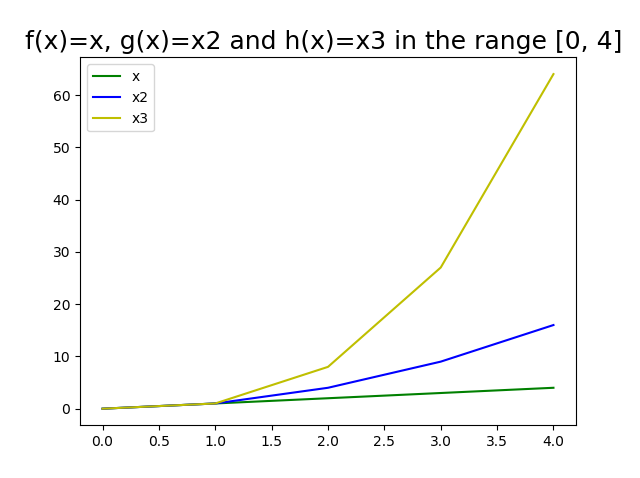

# GMIT Programming and scripting problem sheet 2020

This Repository contains the weekly tasks given in the Programing and Scrpiting module.

## Built with

[Anaconda](https://www.anaconda.com/), 
[Cmder](https://cmder.net/), 
[Visual Studio Code](https://code.visualstudio.com/)

## How to download the Pands-Problem-Sheet-2020 repository

1. Go to Github web site - User Account: AineNicD

(https://github.com/AineNicD)

2. Click on the download button, and copy/paste the link:

https://github.com/AineNicD/pands-problems-sheet-2020.git

## How to run the code

1. Make sure you have [Python](https://www.python.org/downloads/) installed or [Anaconda](https://www.anaconda.com/distribution/).

2. Install [Cmder console emulator](https://cmder.net/), a pre-configured software package that provides you with a great terminal emulator.

3. Download [Visual Studio Code](https://code.visualstudio.com/), this source-code editor will assist you in saving annd editing your code.

## The Tasks 

### Weekly task 2 - bmi.py

Write a program that calculates a person's Body Mass Index (BMI). The inputs are the person's height in centimetres and weight in kilograms. The output is their weight divided by their height in metres, squared.

~~~
$ python bmi.py
Enter weight: 65
Enter height: 180
BMI is 20.06.
~~~

Solution: I first requested input values from user using input() and converted it to float using float().
The BMI formula from  [includehelp.com]( https://www.includehelp.com/python/bmi-body-mass-index-calculator.aspx) which is  bmi = weight / ((height/100)**2).I then rounded it to two decimal places using (round(,2)). 

### Weekly task 3 secondstring.py

Write a program that asks a user to input a string and outputs every second letter in reverse order.

~~~
$ python secondstring.py
Please enter a sentence: The quick brown fox jumps over the lazy dog.
.o zletrv pu o wr cu h
~~~

Solution: I found help with this code on [stackoverflow.com](https://stackoverflow.com/questions/931092/reverse-a-string-in-python)  [::-1] reversed the string and [::2] output every second letter of the reversed.

### Weekly task 4 - collatz.py

Write a program that asks the user to input any positive integer and outputs the successive values of the following calculation. At each step calculate the next value by taking the current value and, if it is even, divide it by two, but if it is odd, multiply it by three and add one. Have the program end if the current value is one.

~~~
$ python collatz.py
Please enter a positive integer: 10
10 5 16 8 4 2 1
~~~

Solution: Using a while loop with the condition to continue while the number > 1, so the program will continue while the number is bigger than 1. Added if statement for if the number is even and else for what to do if the number is odd. 

### Weekly task 5 - weekday.py

Write a program that outputs whether or not today is a weekday. 

An example of running this program on a Thursday is given below.
~~~
$ python weekday.py
Yes, unfortunately today is a weekday.
~~~
An example of running it on a Saturday is as follows.
~~~
$ python weekday.py
It is the weekend, yay!
~~~

Solution: I imported the python calendar for this task, in Python the days of the week are 0-6 and begin with Monday as number 0. Also imported date and time. [Stackoverflow]( https://stackoverflow.com/questions/45870820/how-to-check-if-today-is-monday-in-python) had a great code for picking out the day of the week. 
Used if statement for if weekDay < 5 to print if it is a weekday and else to print it is the weekend. 

### Weekly task 6 - squareroot.py

Write a program that takes a positive floating-point number as input and outputs an approximation of its square root. You should create a function called sqrt that does this.

~~~
$ python squareroot.py
Please enter a positive number: 14.5
The square root of 14.5 is approx. 3.8.
~~~

Solution: On my first attempt, my program calculated the square root but had not used the Newtons algorithm as suggested in the announcements. 
I found many articles online about the Newtons Algorithm, it was challenging to understand until I came across [Roundstone academy](https://runestone.academy/runestone/books/published/thinkcspy/MoreAboutIteration/NewtonsMethod.html). 
### squareroot2.py
To further explore the second piece of code I wrote, I added extra lines within the loop to test the values produced. 

~~~python
print(i)     - is the iterator (loop) so that I can test the current loop 
print(guess) - this is the guess in the current loop
~~~
with them displayed, I got a better grasp of how this code works. 

### Weekly task 7 - escmd.py

Write a program that reads in a text file and outputs the number of e's it contains. The program should take the filename from an argument on the command line.

~~~
$ python es.py moby-dick.txt
116960
~~~

Solution: For this task I imported [sys]( https://docs.python.org/2/library/sys.html); my code was producing an error until I told it to read in Unicode(UTF-8) as the second argument from the command line.
the first argument took in the file name. 

The program reads in the text of the file name entered in the command line using read() function, it then uses count("e") to count the amount of e's within the document. using print() it displays the amount of e's

### Weekly task 8 - plot.py

Write a program that displays a plot of the functions 
f(x)=x, g(x)=x2 and h(x)=x3 in the range [0, 4] on the one set of axes.

Solution: For this task I Used ipython which came with Anaconda, %logstart logs everything done into ipython_log file. Handy for editing to produce the python script. When working with plots, import numpy. Numpy provides a data structure when working with numerical data. Also import Matplotlib, it helps create plots. .arange() can take 1, 2 or 3 numbers as input and will provide you with lists based on the numbers that you have input as arguments. Pythons range() command will only give integers, numpys arrange () command gives float. 
The moodle video "How do I plot in python" by Ian Mc Loughlin was my main source for this task and a great help for learning how to do my first plot.

### Optional Lab Sheet - labs

In this folder are optional lab sheets given by Lectuer Andrew Beatty, he talked us through the solutions in tutorials and he is my main source for these code solutions. I reference any other sources at the bottom of each code. These labs are a great help in my journey to learn python code.

## References:
I reference sources at the botton of each code, here is a list of frequent places I go for help researching how to do my codes. 

1. Lectures by Lecturers Ian McLoughlin and Andrew Beatty on moodle. 

2. [A whirlwind tour of Python by Jake VanderPlas](https://jakevdp.github.io/WhirlwindTourOfPython/).

3. [Stack overflow](https://stackoverflow.com/).

4. [W3schools](https://www.w3schools.com/python/).

5. [The Python Turorial Guide](https://docs.python.org/3/tutorial/).

## Author
Aine Nic Dhonnacha

## Acknowledges

### Lecturers

Ian McLoughlin and Andrew Beatty 

